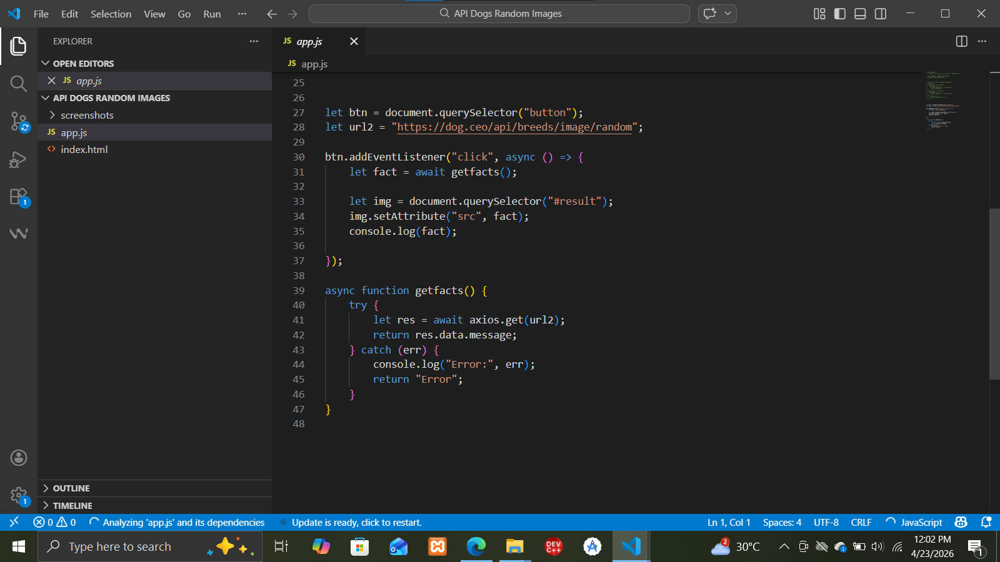
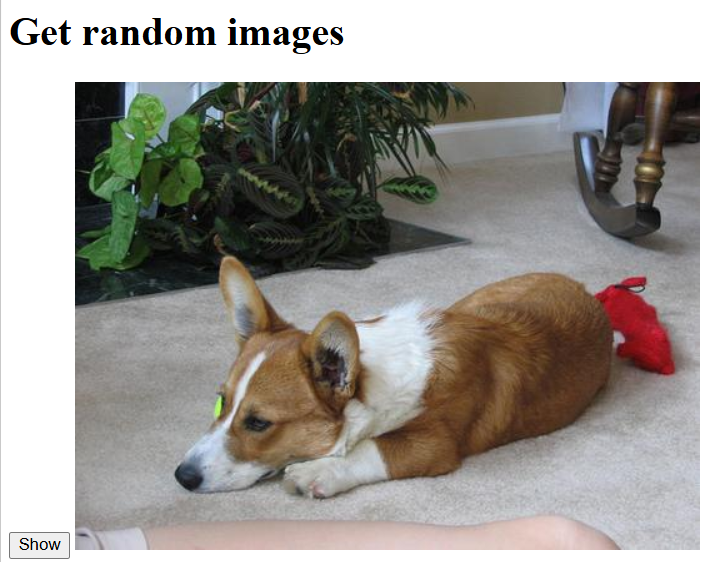

# 🐕 Random Dog Image Generator

A dynamic web application that fetches and displays random dog images using the Dog CEO API. This project demonstrates practical experience with asynchronous JavaScript, DOM manipulation, and handling external APIs.

---

## 📸 Project Previews

### 💻 Logic Implementation
The core functionality is built using an `async` function to fetch data from the API and update the image container dynamically.

### 🖼️ Application Output
A clean and simple user interface where clicking the "Show" button triggers a fresh image fetch.

---

## 🚀 Key Features
* **Asynchronous API Integration:** Uses the `axios` library to perform non-blocking HTTP GET requests.
* **Dynamic Content Loading:** Updates the `src` attribute of the image element in real-time without page reloads.
* **Error Handling:** Implemented using `try...catch` blocks to ensure the application remains stable even if the API request fails.
* **Interactive UI:** Simple, one-button interface designed for ease of use.

## 🛠️ Tech Stack
* **HTML5:** Provides the semantic structure for the application.
* **JavaScript (ES6+):** Handles the application logic, including event listeners and API calls.
* **Axios:** A promise-based HTTP client used to fetch data from the server.
* **Dog CEO API:** The public API providing the random dog image data.

## 📂 Folder Structure
This project is organized within the `Mini-Web-Projects` repository for a professional portfolio presentation:

Mini-Web-Projects/
└── API DOGS RANDOM IMAGES/
    ├── index.html
    ├── app.js
    ├── screenshots/
    │   ├── code.png
    │   └── output.jpg
    └── README.md
⚙️ How to Use
Clone the repository: git clone https://github.com/tayyab007-dot/Mini-Web-Projects.git

Navigate to the project folder:
Go to the API DOGS RANDOM IMAGES directory.

Run the app:
Open index.html in any modern web browser.

Interact:
Click the "Show" button to see a new random dog.
