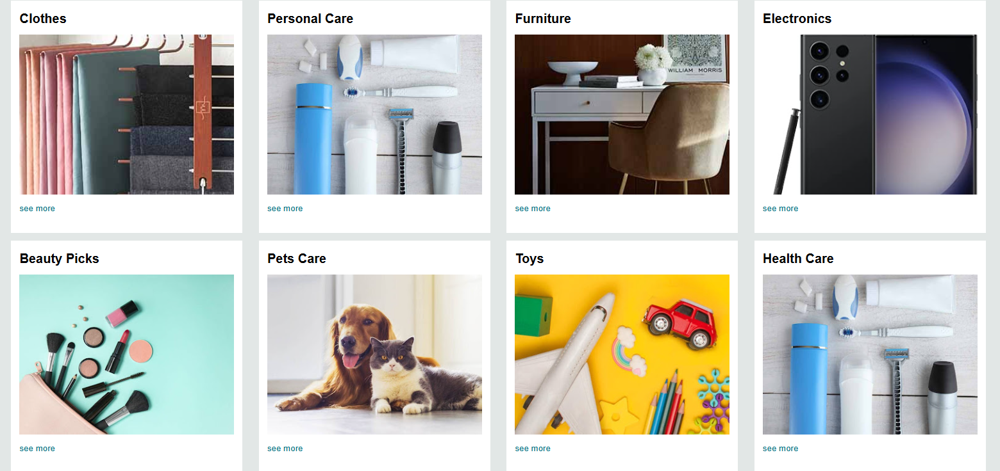

# Amazon Landing Page Clone

This project is a high-fidelity frontend clone of the Amazon homepage. It focuses on replicating complex UI components, including the multi-layered navigation bar, a localized hero section, and a responsive product category grid.

## 📸 Project Previews

### Header & Hero Section
The header features the Amazon logo, a localized delivery indicator for Pakistan, and a fully styled search bar.


### Product Categories
A responsive grid layout displaying various shopping categories with "See More" calls to action.



## 🚀 Key Features
* **Custom Navigation Bar:** Replicated the layout for search, account lists, and returns/orders.
* **Responsive Grid:** Uses CSS layout techniques to organize product cards into a clean 4-column structure.
* **Localized UI:** Includes specific regional elements like the "Deliver to Pakistan" status and localized banner text.
* **Clean Design:** Implements Amazon's specific color palette and typography for an authentic look and feel.

## 🛠️ Tech Stack
* **HTML5:** Semantic structure for the page layout.
* **CSS3:** Custom styling using Flexbox and Grid for alignment and responsiveness.

## 📂 Project Organization
This project is part of my collection of frontend challenges:
```text
Mini-Web-Projects/
└── amazon-clone/
    ├── index.html
    ├── style.css
    ├── landing page.jpg
    └── products.jpg
    └── README.md
```

## ⚙️ How to View Locally
1. Clone this repository: 
   `git clone https://github.com/tayyab007-dot/Mini-Web-Projects.git`
2. Open the `amazon-clone` directory.
3. Launch `index.html` in your preferred web browser.

## 📈 Future Roadmap
* **Interactive Search:** Add logic to simulate searching through product categories.
* **Mobile Optimization:** Further refine the CSS to ensure the grid stacks perfectly on mobile devices.
* **Hover Effects:** Implement detailed hover states for navigation links and product cards.
  
