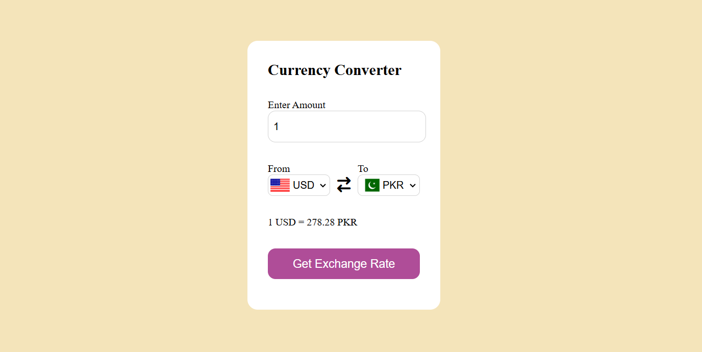
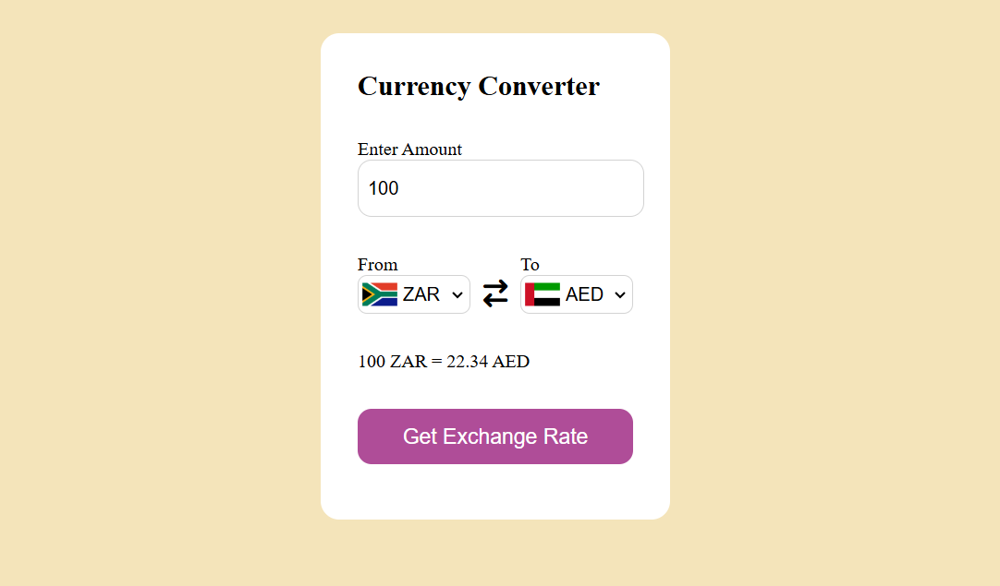

# 💱 Real-Time Currency Converter App

A clean, modern, and responsive Currency Converter web application built using JavaScript (ES6+), HTML5, and CSS3. The application fetches live currency exchange rates dynamically via a stable external API and automatically updates matching country flags whenever a new currency is selected.

## 🚀 Live Demo & Visuals

### Main Interface (Default Setup)


### Dynamic Conversion Example


---

## ✨ Features

- **Live Exchange Rates:** Integrates with the `currency-api` endpoint to fetch reliable, up-to-the-minute market rates.
- **Dynamic Country Flag Integration:** Automatically changes and renders the correct national flags instantly using `flagsapi.com`.
- **Intelligent Input Validations:** Sanitizes user inputs automatically (defaults to `1` if negative or left blank).
- **Smooth UX:** Instant load triggers calculate rates instantly on page load without forcing manual clicks.
- **Clean UI & Responsive Design:** Elegant, minimalist card-based user interface matching modern design standards.

---

## 🛠️ Built With

- **HTML5:** Semantic architecture for structured layouts.
- **CSS3:** Custom styles, modern typography, transitions, and clean form layouts.
- **JavaScript (ES6+):** Modern asynchronous coding practices (`async/await`), DOM manipulation handlers, and event listeners.
- **API Endpoints:** - Exchange Rates: `https://latest.currency-api.pages.dev/v1/currencies`
  - National Flags: `https://flagsapi.com/`

---

## 💻 How It Works (Code Breakdown)

1. **Populating Selections:** Loops over an external geographical index list (`countryList`) to populate currency dropdown menus dynamically.
2. **Asynchronous Fetching:** Executes an optimized API request targeting the selected currency's JSON schema map.
3. **Data Extraction:** Safely extracts the rate key pairs, calculates the user's specific amount product, rounds it off to 2 decimal places, and updates the display cleanly.

---

## ⚙️ Installation & Usage

1. **Clone the repository:**
   ```bash
   git clone [https://github.com/YOUR_USERNAME/YOUR_REPOSITORY_NAME.git](https://github.com/YOUR_USERNAME/YOUR_REPOSITORY_NAME.git)
