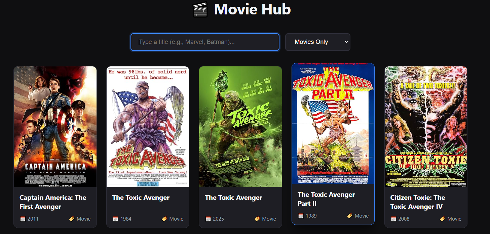
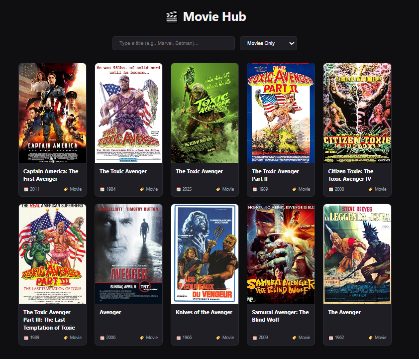
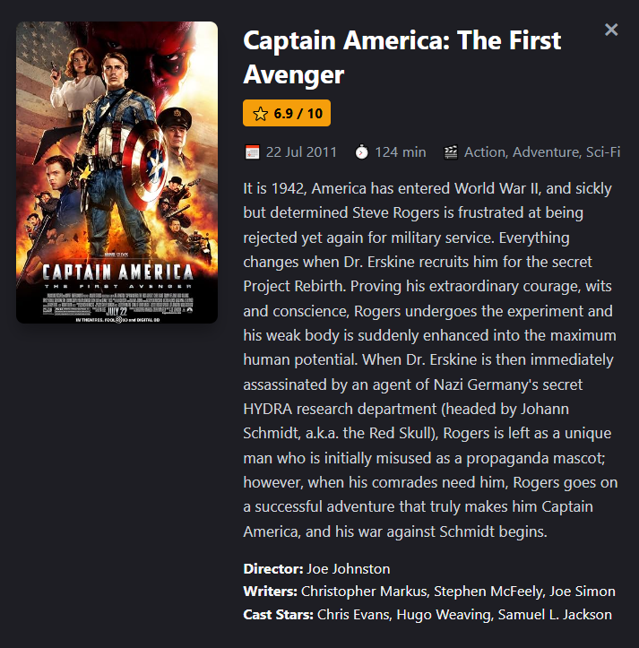

# 🎬 Movie Hub — Single Page Application

An advanced, fully responsive Single Page Application (SPA) built for a **Web Development Internship Assessment**. This application connects seamlessly to the public **OMDb API** to deliver a dynamic movie browsing interface complete with real-time search, multi-format category filtering, and immersive detailed data overlays.

---

## 🚀 Live Demonstration & UI Showcase

### 🖥️ Main Dashboard Overview
The dashboard features an asynchronous grid engine displaying high-resolution movie posters, clear structural taxonomy badges, and adaptive text alignments across fluid viewports.


### 🔍 Advanced Data Querying & Filters
Users can search across thousands of titles with instantaneous debounced request handling alongside strict format category filtering options.


### 🎭 Deep Information Overlay (Modal View)
Clicking on any media item invokes an immersive modal dialog that resolves specific individual lookup profiles including official IMDb ratings, plot synopsis, runtime metrics, and creative crew allocations.


---

## ✨ Features Checklist

- [x] **Asynchronous API Connectivity:** Communicates with the OMDb API via modern `async/await` syntax and secure endpoint parameter setups.
- [x] **Real-Time Search Engine:** Implements client-side input listening paired with a custom **400ms Debounce wrapper** to conserve bandwidth and prevent API query spamming.
- [x] **Dynamic Taxonomy Filter:** Allows cross-filtering by media format types (`All Formats`, `Movies Only`, `TV Series Only`) using dynamic query extensions.
- [x] **Deep Item Lookup Modal:** Triggers a second runtime fetch targeting distinct `imdbID` identifiers to pull full contextual details (IMDb Rating, Runtime, Director, and Cast).
- [x] **Polished UI/UX & Micro-interactions:** Smooth CSS transform transitions (`translateY`) and deep shadows on card hovers provide reactive tactical feedback.
- [x] **Defensive Error Handling:** Includes dedicated fallback placeholders for broken/missing poster graphics, inline search loading statuses, and graceful error alerts if network connections fail.
- [x] **Fully Responsive Canvas:** Hand-crafted via fluid **CSS Grid Layout** (`repeat(auto-fill, minmax(220px, 1fr))`) to scale perfectly without frameworks.

---

## 🛠️ Technology Stack & Architectures

- **Structure:** Semantic HTML5 Markup
- **Styling:** Vanilla CSS3 (Custom Grid Layouts, Glassmorphic Modals, Accent Color Systems, Media Queries)
- **Logic:** Vanilla JavaScript (ES6 Modules, Fetch API, Event Delegation, Asynchronous Promises, Debounce Mechanics)
- **Data Source:** Open Movie Database (OMDb) REST API

---

## 📁 Repository Directory Blueprint

```text
├── index.html          # Structural application canvas & modal scaffolding
├── script.js           # Core asynchronous logic, filter listeners & modal router
└── screenshot/         # Visual UI documentation assets
    ├── main.jpg        # Base application state capture
    ├── all.jpg         # Filtered dataset view state capture
    └── detail.png      # Detailed modal popup layout view capture
